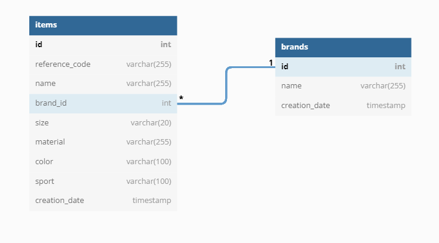
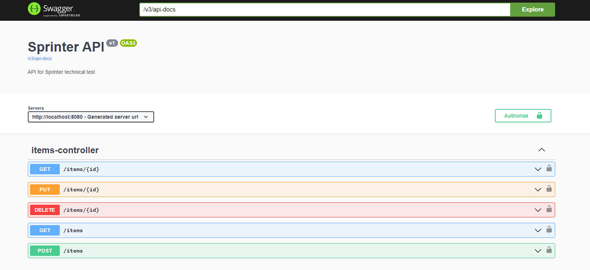

# Sprinter 
Technical test for Sprinter. Spring boot project build with java 1.8 where you can find rest 
endpoints to do a basic items manage. 

The application has created a contract that specifies the list of resources 
available in the REST API and the operations that can be called on these resources.

## Steps to run locally
1. On the command line `git clone https://github.com/Carlitos31c/Sprinter.git`
2. Build the project using `mvn clean install`
3. To run the project you can use docker compose executing in the directory **/docker** 
the following command 

   `docker-compose up` 

   or you can run it from maven using the Spring boot plugin

   `mvn spring-boot:run`
4. The web application is accessible via localhost:8080

## Architecture
The application is build with **Java 1.8** using the last version of **Spring Boot 2.7**.
The frameworks used are detailed below:
* **Openapi generator plugin** to generate objects based on the OpenAPI contract.
* **Springdoc** to use the last version of OpenAPI compatible with Spring Boot 2.7.
* **Springdoc-ui** to see the OpenAPI documentation in HTML format.
* **Springdoc-security** to secure the ui.
* **Lombok** to reduce the code and improve the readability.
* **MapStruct** to simplify the implementation of mapping between objects.
* **H2** in memory database.
* **Spring Data JPA** as implementation of JPA for persistence.
* **Spring Security** to secure the resources with basic authentication.
* **Spring Boot Cache** to manage the cache.
* **Faker** to create fake data for unit test.
* **Dockerized** application with a docker compose allocated in **/docker/docker-compose.yml**.

Additionally, the application has implemented **Unit** and **Integration tests**.

## Structure project
In this project we can find the following structure:
* **/config** for application configuration.
* **/controller** for application Rest resources.
* **/controller/handler** to manage exceptions with controller advice.
* **/entity** for database entities.
* **/exception** to save custom exceptions.
* **/mapper** for application mappers with mapstruct.
* **/repository** for application repositories.
* **/service** for business logic.
* **/resources** for application configuration based on yml files. Schema.sql to generate the database
schema. Data.sql to insert data in the in-memory database.
  * **/openapi** to store the OpenAPI contract.

The structure followed in test wa the same as the one named above.
The nomenclature used is the prefix -Test for Unit test and -IT for Integration tests.

## Database
Database entities are a simple one to many between Items and Brands.

## Authentication
The endpoints are secured with a basic authentication with user and password.

| Username   | Password   |
|------------|------------|
| `sprinter` | `sprinter` |

## OpenAPI
To access the application contract you should do it via web
`http://localhost:8080/swagger-ui/index.html#/`

## OpenAPI Try out
You can test all resources following the steps bellow:
1. Click **Authorize** button.
2. Insert basic authentication user `sprinter` and password `sprinter`.
3. Click **Authorize** button, then you are authorize to try out any resource.
4. Choose the resource you want to test with the **Try it out** button.
5. Insert required data if required and click **Execute** button and you can see the service response.
